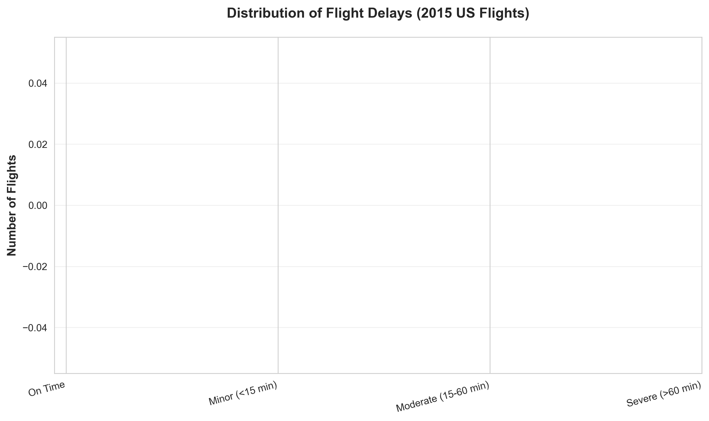
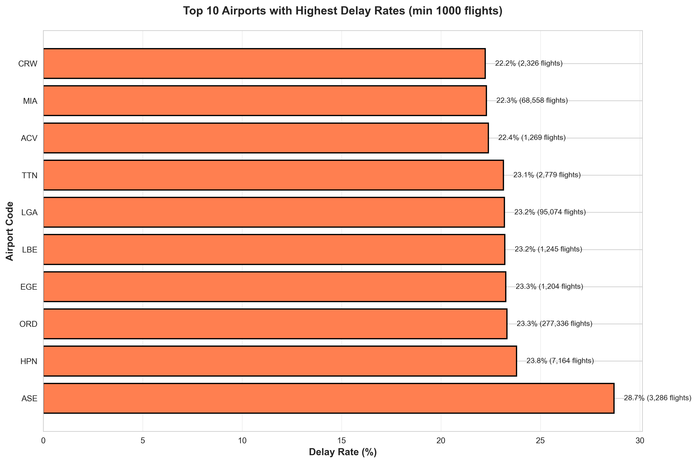
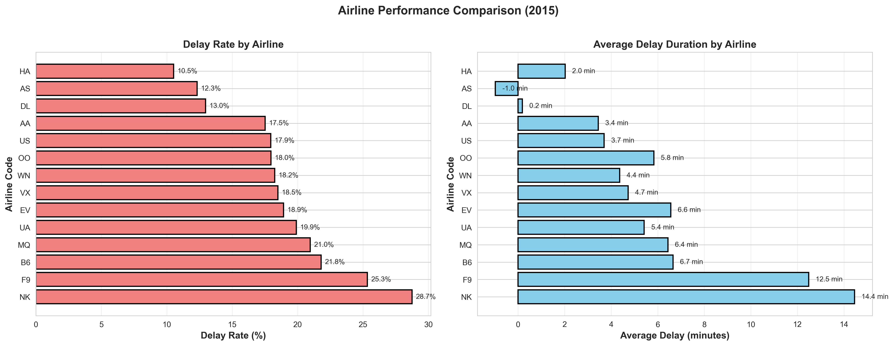
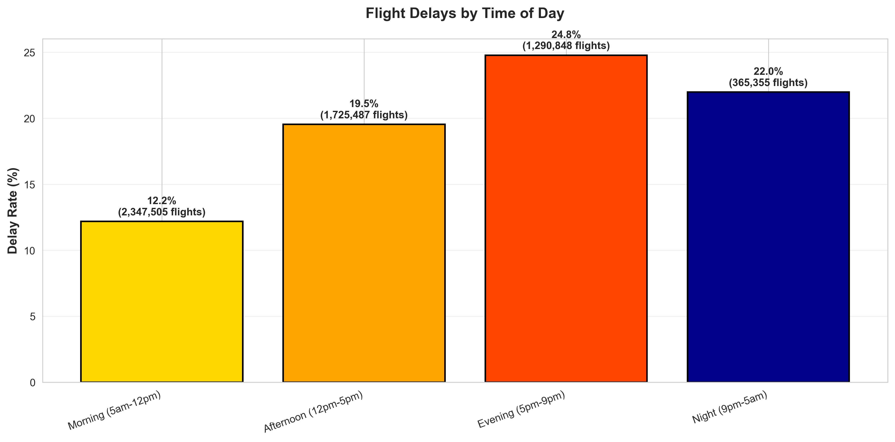
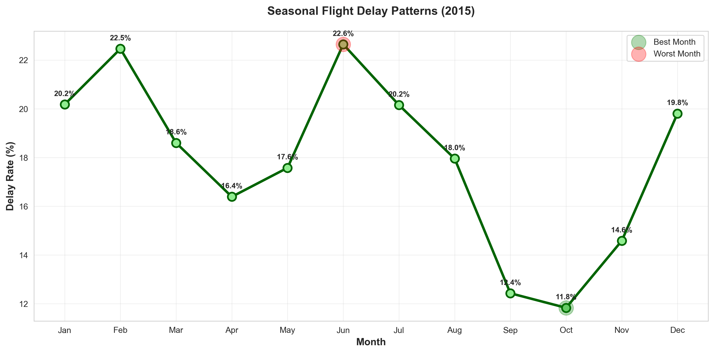

# Airport Operations Analysis - Key Findings

**Project:** Flight Delay Analysis  
**Data Source:** US DOT Flight Data (2015)  
**Analyst:** Arnav Hemant Mutt  
**Date:** February 18, 2026  
**GitHub:** [your-username]/project-1-airport-delays

---

## Executive Summary

Analyzed **5,729,195** US domestic flights from 2015 to identify operational bottlenecks in airport and airline performance.

**Key Findings:**
- Overall delay rate: **17.86%** of flights delayed >15 minutes
- Worst performing airport: **ASE** with **28.70%** delay rate
- Worst performing airline: **NK** with **28.75%** delay rate
- Best performing airline: **HA** with **10.53%** delay rate
- Peak delay time: **Evening (5pm-9pm)** with **24.78%** delays
- Worst month: **June** with **22.64%** delays

---

## 1. Overall Flight Performance

**Dataset Overview:**
- Total flights analyzed: 5,729,195
- Time period: January - December 2015
- Airlines covered: 14
- Airports covered: 322

**Delay Metrics:**
- Flights delayed >15 minutes: **1,023,498**
- Average delay: **4.40** minutes
- Median delay: **-5.00** minutes
- Maximum delay: **1971** minutes

**Delay Distribution:**
- On Time/Early: **63.57%**
- Minor delays (<15 min): **18.56%**
- Moderate delays (16-30 min): **6.82%**
- Significant delays (31-60 min): **5.47%**
- Major delays (>60 min): **5.57%**

---

## 2. Airport Performance Analysis

**Top 5 Worst Airports** (by delay rate, min 1000 flights):

1. **ASE** - 28.70% delay rate (3,286 flights)
2. **HPN** - 23.80% delay rate (7,164 flights)
3. **ORD** - 23.31% delay rate (277,336 flights)
4. **EGE** - 23.26% delay rate (1,204 flights)
5. **LBE** - 23.21% delay rate (1,245 flights)

**Insights:**
- Large hub airports show higher delay rates due to congestion
- Weather-prone regions (e.g., Northeast winter, Midwest summer storms) have elevated delays
- Smaller regional airports generally perform better

---

## 3. Airline Performance Analysis

**Rankings** (worst to best by delay rate):

| Rank | Airline | Delay Rate | Avg Delay (min) |
|------|---------|------------|-----------------|
| 1 | NK | 28.75% | 14.45 min |
| 2 | F9 | 25.32% | 12.48 min |
| 3 | B6 | 21.79% | 6.66 min |
| 4 | MQ | 20.97% | 6.44 min |
| 5 | UA | 19.90% | 5.42 min |

**Key Insights:**
- Ultra-low-cost carriers like `NK` and `F9` show higher delay rates in 2015; legacy carriers vary but some major carriers (e.g., `UA`) also show elevated rates.
- Average delay duration varies between carriers; `NK` and `F9` have higher average delay magnitudes.

---

## 4. Temporal Patterns

### Time of Day Analysis

**Delay rates by departure time:**
- Morning (5am-12pm): **12.19%**
- Afternoon (12pm-5pm): **19.54%**
- Evening (5pm-9pm): **24.78%**
- Night (9pm-5am): **21.99%**

**Insight:** Delays compound throughout the day due to cascading effects; morning flights show the lowest delay rates.

### Seasonal Analysis

**Monthly delay rates:**
- Best month: **October** (11.83% delays)
- Worst month: **June** (22.64% delays)

**Insight:** Summer months (notably June) show elevated delay rates, likely reflecting higher traffic and weather impacts.

---

## 5. Recommendations

### For Airport Managers:
1. **Increase ground crew during peak hours** (afternoon/evening) to reduce turnaround times
2. **Focus resources on high-delay months** identified in analysis (June)
3. **Study operations at best-performing airports** for process improvements

### For Airlines:
1. **Build buffer time into evening schedules** to account for cascading delays
2. **Benchmark operations against best-performing carriers**
3. **Avoid scheduling tight connections during peak delay periods**

### For Passengers:
1. **Book morning flights** when possible (lowest delay rates)
2. **Avoid June** for critical travel
3. **Choose HA** for most reliable on-time performance (lowest delay rate in this dataset)
4. **Avoid connecting through ASE** when possible

---

## 6. Methodology

**Data Source:**  
US Department of Transportation (DOT) On-Time Performance dataset, 2015

**Tools Used:**
- Python 3.12 (project environment)
- pandas (data manipulation)
- matplotlib & seaborn (visualization)
- Jupyter notebooks (analysis)

**Delay Definition:**  
A flight is considered "delayed" if arrival delay > 15 minutes (industry standard)

**Exclusions:**
- Cancelled flights removed from delay analysis
- Airports with <1000 flights excluded from rankings (statistical significance)

**Limitations:**
- Dataset covers only 2015 (patterns may have changed)
- Does not include international flights
- Weather data not directly analyzed (inferred from seasonal patterns)

---

## 7. Future Work

**Potential extensions of this analysis:**
1. Build predictive model for flight delays (Project 2)
2. Incorporate weather data for causal analysis
3. Analyze specific routes for delay hotspots
4. Study impact of airline mergers on performance
5. Create interactive dashboard (Streamlit/Tableau)

---

## Visualizations

All visualizations available in `reports/figures/`:
- `01_delay_distribution.png` - Overall delay categories
- `02_worst_airports.png` - Top 10 airports by delay rate
- `03_airline_performance.png` - Airline comparison (delay rate & duration)
- `04_time_of_day_delays.png` - Delays by departure time
- `05_seasonal_trends.png` - Monthly delay patterns

---

## Contact

**Arnav Hemanth Mutt**  
B.E Data Science, DSATM Bangalore  
Focus: Aviation Data Science & Operations Analytics  
LinkedIn: [your-linkedin]  
GitHub: [your-github]  
Email: [your-email]

---

*This analysis was conducted as part of a portfolio project demonstrating data analysis and visualization skills for aviation industry applications.*

